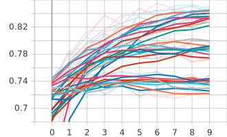
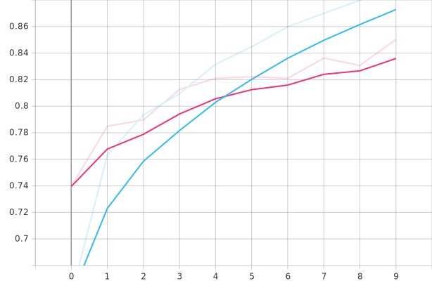

# Cats and Dogs Classifier with CNNs 
Using Kaggle's Cats and Dogs Dataset to train CNN models with varying hyperparameters to find the 'most' optimized model.

## Hyperparameters tested:

| # of Conv. Layers | # of Dense Layers | # of Nodes per Layer |
| :--- |:---| :---|
| 1 | 0 |  32 |
| 2 | 1 |  64 |
| 3 | 2 |  128 |

Validation Accuracy of Trained Models

Validation Loss of Trained Models

### Results

The model with the lowest validation loss after 10 epochs:
* **3 Conv. Layers**
* **0 Dense Layers**
* **64 Nodes per Layer**

Training (blue) vs Validation (red) Accuracy 

Training (blue) vs Validation (red) Loss 

The graph shows signs of over fitting past epoch 5, where EApprox. starts to increase.

### Some Notes

The GPU used for training on my local machine is an RTX 2060. As such, `os.environ['TF_ENABLE_AUTO_MIXED_PRECISION'] = '1'` was added to utilize the Tensor Cores more efficiently. The larger `batch_size=64` is also used for the same purpose. 

